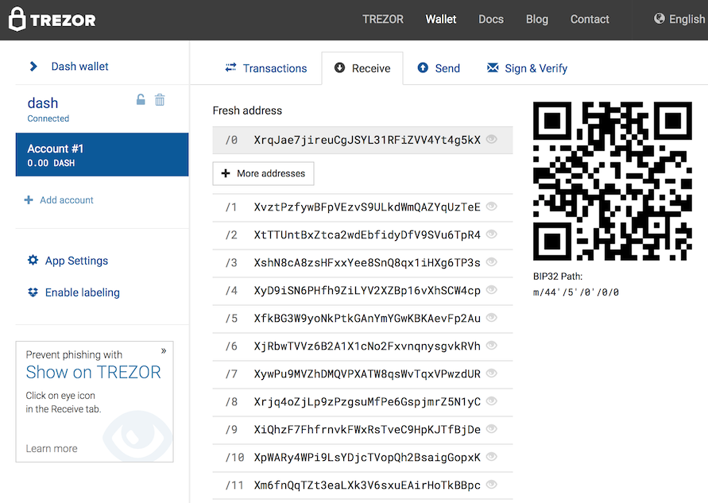
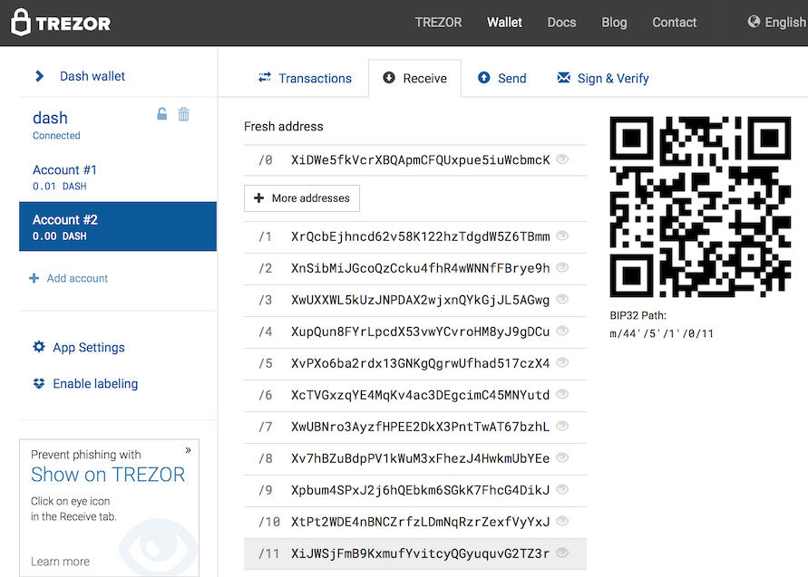
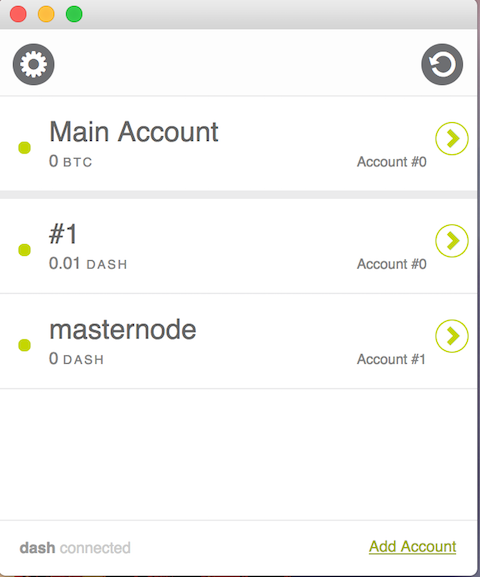
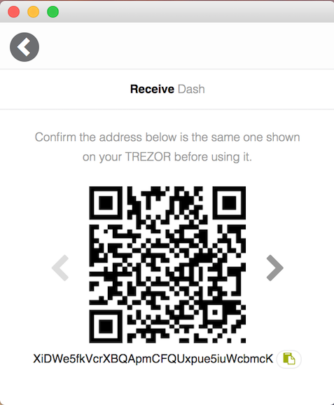

Run Dash Masternode with Hardware Wallet
=========================================

#### TESTNET ONLY ####

###### Q : why firmware update ?
    - to support Dash testnet, both trezor and keepkey has only Mainnet.
    - with Mainnet, no need to update firmware. Use official firmware.

###### Q : which hw wallet supported ?
    - Trezor
    - Keepkey
    - dashmnb will not run without hw wallet

###### Q : what can dashmnb do
    - config check (alias, address, ip, key, pkey, hw wallet path)
    - start masternode missing, selected
    - show masternode status
    - send coins(mn payment) in hw wallet
    - send collateral + coins(mn payment) in hw wallet
    - ssh tunnel to use remote dashd

###### Q : why Dash-QT or dashd needed ?
    - instead of block explorer 
    - to check address, collateral, masternode status
    - to get unspent tx of collateral
    - to relay mnb and txs

###### Q : why do -rescan
    - -rescan means restaring dashd or Dash-QT with -rescan option
    - after initial checking of masternode config, dashmnb will ask you to do rescan
    - add following to dash.con and run dashd with dashd -rescan
    
```
    addressindex=1
    spentindex=1
    timestampindex=1
    txindex=1
```

## Installation

### 1. Install Prerequisites (Ubuntu/Debian)

Make sure Python version 3.5.1 or above is installed:

    python --version

Update system packages and ensure virtualenv is installed:

    $ sudo apt-get update
    $ sudo apt-get install libudev-dev libusb-1.0-0-dev libfox-1.6-dev
    $ sudo apt-get install autotools-dev autoconf automake libtool
    $ sudo apt-get -y install python3-pip git
    $ sudo pip3 install virtualenv


### 1. Install Prerequisites (Mac oS)

Install brew and python3

    $ /usr/bin/ruby -e "$(curl -fsSL https://raw.githubusercontent.com/Homebrew/install/master/install)"    
    $ brew install python3 git
    $ pip3 install virtualenv


### 2. Install dashmnb

Clone the dashmnb repo and install Python dependencies.

    $ git clone https://github.com/chaeplin/dashmnb && cd dashmnb
    $ virtualenv -p python3 venv3
    $ . venv3/bin/activate
    $ pip install --upgrade setuptools
    $ pip install -r requirements.txt

## 3. Update

    $ cd dashmnb
    $ git pull

## Udev rule set up for linux

To use keepkey or trezor as normal user, do following

    $ sudo cp others/linux/51-* /etc/udev/rules.d/


## Configuration

- Move dashlib/config.sample.mainnet[testnet].py to dashlib/config.py and edit parameters
    - for testnet dashlib/config.sample.mainnet.py to dashlib/config.py
    - for mainet dashlib/config.mainet.testnet.py to dashlib/config.py


- Use python bin/hw-wallet-for-mn.py to get a list of address

        $ cd dashmnb
        $ . venv3/bin/activate
        $ python bin/hw-wallet-for-mn.py

```
(venv3) > $ python bin/hw-wallet-for-mn.py 
    ____             __  
   / __ \____ ______/ /_ 
  / / / / __ `/ ___/ __ \
 / /_/ / /_/ (__  ) / / /
/_____/\__,_/____/_/ /_/ 
                         
    __  ___           __                            __   
   /  |/  /___ ______/ /____  _________  ____  ____/ /__ 
  / /|_/ / __ `/ ___/ __/ _ \/ ___/ __ \/ __ \/ __  / _ \
 / /  / / /_/ (__  ) /_/  __/ /  / / / / /_/ / /_/ /  __/
/_/  /_/\__,_/____/\__/\___/_/  /_/ /_/\____/\__,_/\___/ 
                                                         
           _ __  __       __  ___       __   _       __      ____     __ 
 _      __(_) /_/ /_     / / / / |     / /  | |     / /___ _/ / /__  / /_
| | /| / / / __/ __ \   / /_/ /| | /| / /   | | /| / / __ `/ / / _ \/ __/
| |/ |/ / / /_/ / / /  / __  / | |/ |/ /    | |/ |/ / /_/ / / /  __/ /_  
|__/|__/_/\__/_/ /_/  /_/ /_/  |__/|__/     |__/|__/\__,_/_/_/\___/\__/  
                                                                         

            by : chaeplin

Network : MAINNET
===> trezor HW Wallet found
Use the numeric keypad to describe number positions. The layout is:
    7 8 9
    4 5 6
    1 2 3
Please enter current PIN: 

Passphrase required: 

Confirm your Passphrase: 

**** ====> use following address for 1K collateral of masternode
Dash address: 44'/5'/1'/0/0        XiDWe5fkVcrXBQApmCFQUxpue5iuWcbmcK
Dash address: 44'/5'/1'/0/1        XrQcbEjhncd62v58K122hzTdgdW5Z6TBmm
Dash address: 44'/5'/1'/0/2        XnSibMiJGcoQzCcku4fhR4wWNNfFBrye9h
Dash address: 44'/5'/1'/0/3        XwUXXWL5kUzJNPDAX2wjxnQYkGjJL5AGwg
......

**** ====> use following address for trezor/keepkey wallet(default path)
Dash address: 44'/5'/0'/0/0        XrqJae7jireuCgJSYL31RFiZVV4Yt4g5kX
Dash address: 44'/5'/0'/0/1        XvztPzfywBFpVEzvS9ULkdWmQAZYqUzTeE
Dash address: 44'/5'/0'/0/2        XtTTUntBxZtca2wdEbfidyDfV9SVu6TpR4
Dash address: 44'/5'/0'/0/3        XshN8cA8zsHFxxYee8SnQ8qx1iHXg6TP3s
.......

```

- Use trezor web wallet or keepkey rc clinet to compare address and send 1K Dash to an address of Account #1

- Use Account #0 for daily use

- To add Account #1, should send small amount to an address of Account #0 

https://www.keepkey.com/2017/02/02/dash-now-public-beta/

https://blog.trezor.io/multi-currency-support-bitcoin-dash-and-zcash-in-trezor-wallet-7377d812112a#.36ft1p2c1








- Set up remote masternode, add following to dashd.conf.

        addressindex=1
        spentindex=1
        timestampindex=1
        txindex=1

- Run once with -rescan, to make index

        $ dashd -rescan

- Move mnconf/masternode.conf.sample to mnconf/masternode.conf and edit

- Run dashmnb.py

        $ cd dashmnb
        $ . venv3/bin/activate
        $ python bin/dashmnb.py


###### Thanks to
- codes form https://github.com/dashpay/electrum-dash
- ref : https://github.com/dashpay/dash/blob/v0.12.1.x/dash-docs/protocol-documentation.md by 

