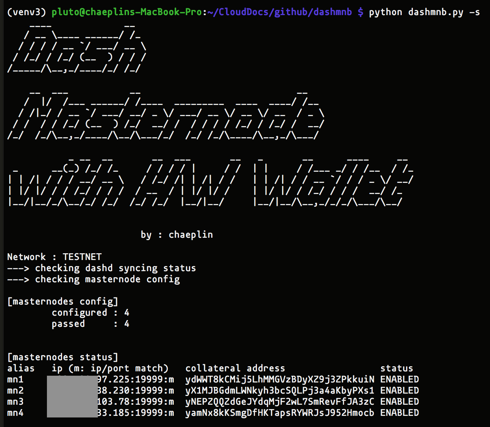
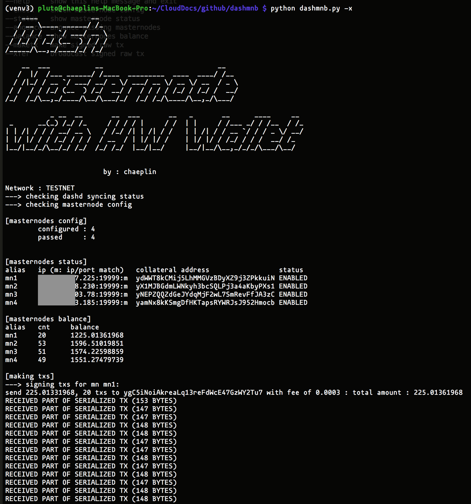

Run Dash Masternode with Hardware Wallet
=========================================

#### TESTNET ONLY ####






#### requirement
- Dash-QT or dashd
- Keepkey, Trezor(not yet) 
- keepkey-firmware
- rpc conn to Dash-QT or dashd
- python3
- python-keepkey
- python-bitcoinrpc
- python-progress
- python-pyfiglet
- python-bip32utils

#### Keepkey firmware
- Build your own firmware
- https://github.com/chaeplin/dash-testnet/tree/master/keepkey_firmware

### python lib
- use python-virtualenv3
- https://github.com/chaeplin/python-keepkey
- https://github.com/chaeplin/python-bitcoinrpc
- https://github.com/verigak/progress
- https://github.com/pwaller/pyfiglet
- https://github.com/chaeplin/bip32utils
- lib (sub dir)
```
virtualenv -p python3 venv3
source venv3/bin/activate
python "pg to run"
```

### How to
- use keepkey-for-mn.py to gen a list of address (change key path = mpath)
- send 1k tDash to Address
- set up remote masternode
- move config.py.sample to config.py and edit parameters
- move masternode.conf.sample to masternode.conf and edit
- run Dash-QT or dashd
- run dashmnb.py

### Using remote dashd
- ssh tunnel
- ssh -L 19998:localhost:19998 -N username@192.168.10.10 (-N(keep tunnel, not loggn in) -L local_port:dest_ip:dest_port )


####
    https://test.explorer.dash.org/tx/dec9c5ef0b4f82b77107f29e0096a30faacbf068f5b46a106726b02036caaeb4#o0
    https://test.explorer.dash.org/tx/82552b6626c9d2ea35c5295135b09acd351a28f552d3a666612d85e36f805e26#o0
    https://test.explorer.dash.org/tx/11c3467a318e33d5b45c588c1676b9d09f4999a96c8ce720b9d4d5815181e28a#o0
    https://test.explorer.dash.org/tx/b7910641dcc640154947d8610ebbdc1e52b7c43383a8b4e96cde6fbd089780a2#o0