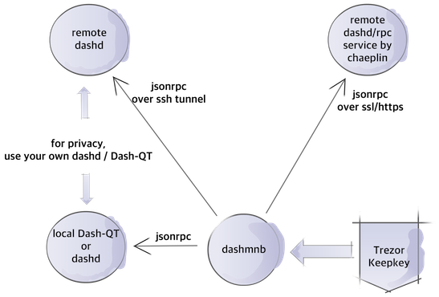

run dash masternode with hardware wallet
=========================================

# Contents
- [Blocks](#blocks)
- [Q&A](#qa)
- [Help](#help)
- [Installation](#installation)
- [Update](#update)
- [Debug](#debug)
- [Configuration](#configuration)
- [Runowndashd](#to-run-own-dashd--dash-qt)
- [Thankyou](#thankyou)

# MAINNET READY
    - start mn working
    - sending payout working
    
## Blocks


## Q&A

###### Q : why firmware update ?
    - to support Dash testnet, both trezor and keepkey has only Mainnet.
    - with Mainnet, no need to update firmware. Use official firmware.

###### Q : which hw wallet supported ?
    - Trezor
    - Keepkey
    - dashmnb will not run without hw wallet

###### Q : what can dashmnb do
    - config check (alias, address, ip, key, pkey, hw wallet path)
    - start masternode missing, selected
    - show masternode status
    - send payout in hw wallet
    - send collateral + coins(mn payouts) in hw wallet
    - ssh tunnel to use remote dashd
    - can use remote rpc service

###### Q : can I use mixed bip32 path
    - dashmnb support only one bip32 path
    - can't use mixed(ex: 44'/5'/x'/0/0 + 44'/5'/y'/0/0) path together

###### Q : spend payout
    - don't use trezor web wallet to move payout in Masternode account
    - it will break your masternode. trezor web wallet has no coincontrol
    - use dashmnb.py -x or  dashmnb.py -x mnalias1 mnalias2. 

###### Q : how 'remote dashd/rpc service' works ?
    - using nginx as proxy
    - lua script by https://github.com/adetante/ethereum-nginx-proxy
    - need to change version checking
    - use ssl by default
    - add http basic auth to nginx
    - change Authorization header using proxy_set_header
    - rpc user name and password on config.py is only for web auth
    - use remote rpc service
    - use dashlib/config.sample.mainnet.remotesvc.py


## Help
```
(venv3) ~/dashmnb $ python bin/dashmnb.py
usage: dashmnb.py [-h] [-c] [-s] [-a] [-b] [-l] [-m] [-x]
                  [masternode_alias_to_start/spend [masternode_alias_to_start/spend ...]]

positional arguments:
  masternode_alias_to_start/spend

optional arguments:
  -h, --help            show this help message and exit
  -c, --check           check masternode config
  -s, --status          show masternode status
  -a, --anounce         anounce missing masternodes
  -b, --balance         show masternodes balance
  -l, --showall         show all configured masternodes
  -m, --maketx          make signed raw tx
  -x, --xfer            broadcast signed raw tx


    version  : 0.3.rc5
    caller   : <module>
    function : parse_args
    ===> print help

```


## Installation

### 1.a Install Prerequisites (Ubuntu)

Make sure Python version 3.5.1 or above is installed:

    python3 --version
    or
    python3 -V

#### if python3 is is above 3.5.1
Update system packages and ensure virtualenv is installed:

    sudo apt-get update
    sudo apt-get install libudev-dev libusb-1.0-0-dev libfox-1.6-dev
    sudo apt-get install autotools-dev autoconf automake libtool
    sudo apt-get -y install python3-pip git
    sudo pip3 install virtualenv

#### if python3 is 3.4.x
go to [Installation](#installation) and install python-3.5.3 

### 1.b Install Prerequisites (Mac oS)

Install brew and python3.5 or python3.6 

    /usr/bin/ruby -e "$(curl -fsSL https://raw.githubusercontent.com/Homebrew/install/master/install)"    
    brew install python3 git
    pip3 install virtualenv


### 2. Install dashmnb

#### if python3 is is above 3.5.1
Clone the dashmnb repo and install Python dependencies.

    git clone https://github.com/chaeplin/dashmnb && cd dashmnb
    virtualenv -p python3 venv3
    . venv3/bin/activate
    pip install --upgrade setuptools
    pip install -r requirements.txt


#### if python3 is 3.4.x
Clone the dashmnb repo and install Python 3.5.3 and Python dependencies.


    git clone https://github.com/chaeplin/dashmnb && cd dashmnb
    sh ./others/linux/python-3.5.3-install.sh
    virtualenv -p python3.5 venv3
    . venv3/bin/activate
    pip install --upgrade setuptools
    pip install -r requirements.txt


### 3. Udev rule set up for linux (Ubuntu)

To use keepkey or trezor as normal user, do following

    sudo cp others/linux/51-* /etc/udev/rules.d/


## Update

    cd dashmnb
    . venv3/bin/activate
    git pull

    pip install --upgrade git+https://github.com/chaeplin/python-trezor
    pip install --upgrade git+https://github.com/chaeplin/python-keepkey


## debug

    add DASHMNB_DEBUG=1 

    cd dashmnb
    . venv3/bin/activate
    DASHMNB_DEBUG=1 python bin/dashmnb.py


## Configuration

### 1. copy dashlib/config.xxxx.py to dashlib/config.py and edit parameters
    
    - copy dashlib/config.sample.mainnet.remotesvc.py to use remote rpc service by chaeplin
    - copy dashlib/config.sample.mainnet.remotesvc.py to run own dashd/Dash-QT
    
    - testing config.py : no output if config.py is ok

        cd dashmnb
        . venv3/bin/activate
        python dashlib/config.py


### 2.  Use python bin/hw-wallet-for-mn.py to get a list of address

        cd dashmnb
        . venv3/bin/activate
        python bin/hw-wallet-for-mn.py

```
(venv3) > python bin/hw-wallet-for-mn.py 
    ____             __  
   / __ \____ ______/ /_ 
  / / / / __ `/ ___/ __ \
 / /_/ / /_/ (__  ) / / /
/_____/\__,_/____/_/ /_/ 
                         
    __  ___           __                            __   
   /  |/  /___ ______/ /____  _________  ____  ____/ /__ 
  / /|_/ / __ `/ ___/ __/ _ \/ ___/ __ \/ __ \/ __  / _ \
 / /  / / /_/ (__  ) /_/  __/ /  / / / / /_/ / /_/ /  __/
/_/  /_/\__,_/____/\__/\___/_/  /_/ /_/\____/\__,_/\___/ 
                                                         
           _ __  __       __  ___       __   _       __      ____     __ 
 _      __(_) /_/ /_     / / / / |     / /  | |     / /___ _/ / /__  / /_
| | /| / / / __/ __ \   / /_/ /| | /| / /   | | /| / / __ `/ / / _ \/ __/
| |/ |/ / / /_/ / / /  / __  / | |/ |/ /    | |/ |/ / /_/ / / /  __/ /_  
|__/|__/_/\__/_/ /_/  /_/ /_/  |__/|__/     |__/|__/\__,_/_/_/\___/\__/  
                                                                         

            by : chaeplin

Network : MAINNET
===> trezor HW Wallet found
Use the numeric keypad to describe number positions. The layout is:
    7 8 9
    4 5 6
    1 2 3
Please enter current PIN: 

Passphrase required: 

Confirm your Passphrase: 

**** ====> use following address for 1K collateral of masternode
Dash address: 44'/5'/1'/0/0        XiDWe5fkVcrXBQApmCFQUxpue5iuWcbmcK
Dash address: 44'/5'/1'/0/1        XrQcbEjhncd62v58K122hzTdgdW5Z6TBmm
Dash address: 44'/5'/1'/0/2        XnSibMiJGcoQzCcku4fhR4wWNNfFBrye9h
Dash address: 44'/5'/1'/0/3        XwUXXWL5kUzJNPDAX2wjxnQYkGjJL5AGwg
```

- Use trezor web wallet or keepkey rc clinet to compare address and send 1K Dash to an address
- If you funds on trezor already, use trezor web wallet or keepkey rc clinet to find bip32 path


### 3.  copy mnconf/masternode.conf.sample to mnconf/masternode.conf and edit

    cp mnconf/masternode.conf.sample mnconf/masternode.conf


### 4.  Run dashmnb.py

        cd dashmnb
        . venv3/bin/activate
        python bin/dashmnb.py


## to run own dashd / Dash-QT


###### Q : why Dash-QT or dashd needed ? [if you want to run your own dashd/QT]
    - if you use `remote dashd/rpc service` don't need
    - instead of block explorer 
    - fast, reliable
    - for privacy
    - to check address, collateral, masternode status
    - to get unspent tx of collateral
    - to relay mnb and txs


###### Q : why do -reindex ? [if you want to run your own dashd/QT]
    - if you use `remote dashd/rpc service` don't need
    - -reindex means restaring dashd or Dash-QT with -reindex option
    - after initial checking of masternode config, dashmnb will ask you to do reindex

###### Q : Which one to do first [if you want to run your own dashd/QT]
    - if you use `remote dashd/rpc service` don't need
    - Set up local/remote node, add following to dashd.conf. check dash.conf.sample

```
    rpcuser=dashrpc#change
    rpcpassword=veryvey-long-complicatedpassword=#change
    rpcallowip=127.0.0.1
    rpcbind=127.0.0.1
    rpcport=9998
    server=1
    daemon=1
    logips=1
    addressindex=1
    spentindex=1
    timestampindex=1
    txindex=1
```

    Run once with dashd/QT with -reindex, to make index

###### add ssh key to remote node [if you want to run your own dashd/QT]

https://www.digitalocean.com/community/tutorials/how-to-set-up-ssh-keys--2


## Thankyou
- codes form https://github.com/dashpay/electrum-dash
- ref : https://github.com/dashpay/dash/blob/v0.12.1.x/dash-docs/protocol-documentation.md

