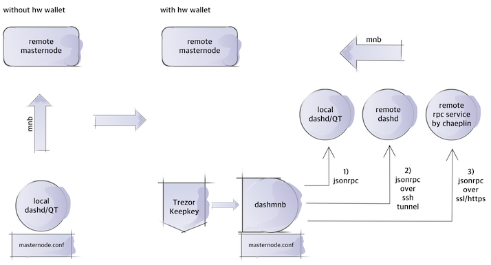
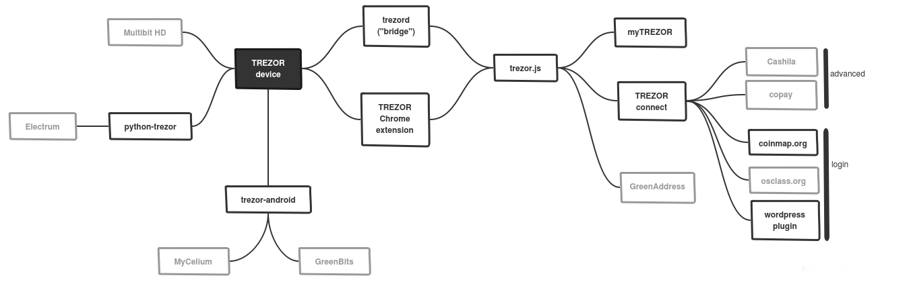
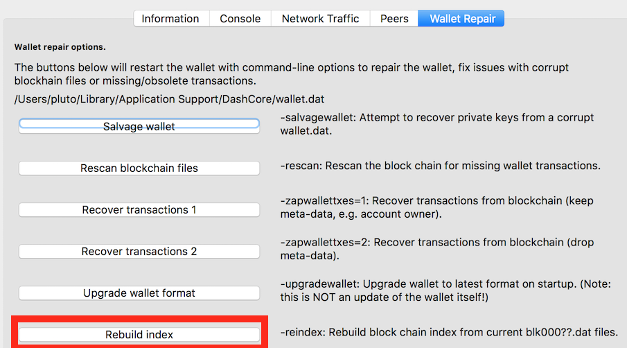

run dash masternode with hardware wallet / dashmnb simplify local cold wallet part
==================================================================================

# read faq of trezor, and understand how trezor/keepkey works
- backup up your 12/24 words seed

- [https://doc.satoshilabs.com/trezor-faq/overview.html](https://doc.satoshilabs.com/trezor-faq/overview.html)

# need python version above 3.5.1 

# if you get err `error occurred while verifying mnb hex` when using `-a`, be sure to update firmware

# Contents
- [Blocks](#blocks)
- [Q&A](#qa)
- [Help](#help)
- [Installation](#installation)
- [Update](#update)
- [Debug](#debug)
- [Configuration](#configuration)
- [Runowndashd](#to-run-own-dashd--dash-qt)
- [Vote](#vote)
- [Support](#support)
- [Thankyou](#thankyou)

# MAINNET READY
    - starting mn(s) works
    - sending payout(s) works
    - voting works
    
## Blocks


## Q&A

###### Q : why firmware update ?
    - to support Dash testnet, both trezor and keepkey has only Mainnet.
    - with Mainnet, no need to update firmware. Use official firmware.

###### Q : which hw wallet supported ?
    - Trezor
    - Keepkey
    - Ledger nano s(no transaction yet)
    - dashmnb will not run without hw wallet

###### Q : what can dashmnb do
    - dashmnb simplify local cold wallet part
    - config check (alias, address, ip, key, pkey, hw wallet path)
    - start masternode missing, selected
    - show masternode status
    - send payout in hw wallet
    - send collateral + coins(mn payouts) in hw wallet
    - ssh tunnel to use remote dashd
    - can use remote rpc service

### Q : can I use multiple Account #'x' with dashmnb ?
    - dashmnb support only single Account #'x'(single path)
    - can't use mixed account name(Account #1 + Account #2) together
    - can't use mixed(ex: 44'/5'/x'/0/0 + 44'/5'/y'/0/0) path together


### Q : how to speed up config checking speed ?
    - use cache option on config.py
```
# if config.py and masternode.x.conf unchanged, recheck config every 7
# day, and 6 hour
#config_cache_refresh_interval_hour = 7 * 24

# txs
#txs_cache_refresh_interval_hour = 6

# disable cache
config_cache_refresh_interval_hour = 0
txs_cache_refresh_interval_hour = 0
````


###### Q : example for web wallet of Trezor ?
check [trezor example](https://github.com/chaeplin/dashmnb/tree/master/others/pics/trezor)

###### Q : spend payout
    - don't use trezor web wallet to move payout in Masternode account
    - it will break your masternode. trezor web wallet has no coincontrol
    - use dashmnb.py -x or  dashmnb.py -x mnalias1 mnalias2. 

###### Q : how 'remote dashd/rpc service' works ?
    - using nginx as proxy
    - lua script by https://github.com/adetante/ethereum-nginx-proxy
    - need to change version checking
    - using ssl by default
    - add http basic auth to nginx
    - change Authorization header using proxy_set_header
    - rpc user name and password on config.py is only for web auth
    - use remote rpc service
    - use dashlib/config.sample.mainnet.remotesvc.py

###### Q : dashmnb ask PIN(or PASSPHRASE) of Trezor/Keepkey, why ?


read [https://doc.satoshilabs.com/trezor-faq/](https://doc.satoshilabs.com/trezor-faq/)

[https://doc.satoshilabs.com/trezor-tech/api.html](https://doc.satoshilabs.com/trezor-tech/api.html)

    - dashmnb use python-trezor / python-keepkey as API to communicate Trezor/Keepkey

[https://github.com/chaeplin/python-trezor](https://github.com/chaeplin/python-trezor)
    
[https://github.com/chaeplin/python-keepkey](https://github.com/chaeplin/python-keepkey)
    
    - The API ask you PIN(or PASSPHRASE) when first connected or a transaction requested

###### Q : Is there any privacy concern when using `remote dashd/rpc service by you` 
    - dashmnb use rpc command to get a blockchain info.
    - rpc command are following, and no logging occur on rpc command
``` 
    decoderawtransaction --> to get a transaction is correct
    getaddressbalance    --> to get balance of a mn
    getaddressutxos      --> to get unspent tx(s) of a mn
    getblockcount        --> to get current block height
    getblockhash         --> to get current blockhash and (current block height -12) blockhash
    getrawtransaction    --> to get collateral address on masternode.conf
    listunspent          --> replaced by getaddressutxos
    masternodebroadcast  --> to decode / relay mnb(s)
    masternodelist       --> to get masternode list and address
    getinfo              --> to get current block height
    sendrawtransaction   --> to relay a transaction made
    validateaddress      --> to check collateral_address, receiving_address, masternode_address are ok
    voteraw              --> to vote proposal
    gobject              --> to get list of proposal
    mnsync               --> to get sync status
```

    - dashmnb connects remote service using ssl  
    - However `remote dashd/rpc service` use nginx(web server) as frontend

[https://github.com/chaeplin/dash-ticker/tree/master/web/nginx](https://github.com/chaeplin/dash-ticker/tree/master/web/nginx) has frontend configuration

    - As nginx(web server) leave a log containning ip address of user like following
```    
10.10.10.1 - dashmnb [18/Feb/2017:06:13:33 +0000] "POST / HTTP/1.1" 200 227 "-" "AuthServiceProxy/0.1" "-" [-] [-] []
10.10.10.1 - dashmnb [18/Feb/2017:06:13:39 +0000] "POST / HTTP/1.1" 200 227 "-" "AuthServiceProxy/0.1" "-" [-] [-] []
10.10.10.1 - dashmnb [18/Feb/2017:06:13:44 +0000] "POST / HTTP/1.1" 200 92 "-" "AuthServiceProxy/0.1" "-" [-] [-] []
10.10.10.1 - dashmnb [18/Feb/2017:06:13:54 +0000] "POST / HTTP/1.1" 200 359050 "-" "AuthServiceProxy/0.1" "-" [-] [-] []
```
    - The ip address is `privacy concern`


## Help
```
python bin/dashmnb.py 
usage: dashmnb.py [-h] [-c] [-s] [-a] [-b] [-y] [-n] [-f] [-q] [-l] [-m] [-x]
                  [-w]
                  [mnalias[s] or a proposal_hash [mnalias[s] or a
                  proposal_hash ...]]

positional arguments:
  mnalias[s] or a proposal_hash

optional arguments:
  -h, --help            show this help message and exit
  -c, --check           check masternode config
  -s, --status          show masternode status
  -a, --anounce         anounce missing masternodes
  -b, --balance         show masternodes balance
  -y, --voteyes         vote Yes to a proposal using all mns
  -n, --voteno          vote No to a proposal using all mns
  -f, --voteabstain     vote Abstain to a proposal using all mns
  -q, --votequery       get vote status on a proposal by all mns
  -l, --showall         show all configured masternodes
  -m, --maketx          make signed raw tx
  -x, --xfer            broadcast signed raw tx
  -w, --whale           do not ask yes or no, all yes


    version  : 0.4.rc1
    caller   : <module>
    function : parse_args
    ===> print help

```


## Installation


#### [Ubuntu 16.04 --> use this link](https://github.com/chaeplin/dashmnb/tree/master/others/pics/ubuntu-16.04)
#### [Ubuntu 14.04 --> use this link](https://github.com/chaeplin/dashmnb/tree/master/others/pics/ubuntu-14.04)
#### [Debian 8.7.1 --> use this link](https://github.com/chaeplin/dashmnb/tree/master/others/pics/debian-8.7.1)
#### [WIndows 10 --> use this link](https://github.com/chaeplin/dashmnb/tree/master/others/pics/windows10)
#### Mac OSX --> check 1.b Install Prerequisites (Mac oS)


### 1.a Install Prerequisites (Ubuntu)


Make sure Python version 3.5.1 or above is installed:

    python3 --version
    or
    python3 -V

#### if python3 is is above 3.5.1
Update system packages and ensure virtualenv is installed:

    sudo apt-get update
    sudo apt-get install libudev-dev libusb-1.0-0-dev libfox-1.6-dev
    sudo apt-get install autotools-dev autoconf automake libtool
    sudo apt-get -y install python3-pip git
    sudo pip3 install virtualenv

#### if python3 is 3.4.x
go to [Install dashmnb](#2-install-dashmnb) and install python-3.5.3 

### 1.b Install Prerequisites (Mac oS)

Install brew and python3.5 or python3.6 

    /usr/bin/ruby -e "$(curl -fsSL https://raw.githubusercontent.com/Homebrew/install/master/install)"    
    brew install python3 git
    pip3 install virtualenv


### 2. Install dashmnb

#### if python3 is is above 3.5.1
Clone the dashmnb repo and install Python dependencies.

    git clone https://github.com/chaeplin/dashmnb && cd dashmnb
    virtualenv -p python3 venv3
    . venv3/bin/activate
    pip install --upgrade setuptools
    pip install -r requirements.txt


#### if python3 is 3.4.x
Clone the dashmnb repo and install Python 3.5.3 and Python dependencies.

    sudo apt-get update
    sudo apt-get -y git
    git clone https://github.com/chaeplin/dashmnb && cd dashmnb
    sh ./others/linux/python-3.5.3-install.sh
    virtualenv -p python3.5 venv3
    . venv3/bin/activate
    pip install --upgrade setuptools
    pip install -r requirements.txt


### 3. Udev rule set up for linux (Ubuntu)

To use keepkey or trezor as normal user, do following


    sudo cp others/linux/51-* /etc/udev/rules.d/

When you see the following err while running dashmnb first time, need system reboot to apply udev rule
```
    Network : MAINNET
    ===> trezor HW Wallet found


    version  : 0.3.rc5
    caller   : main
    function : check_hw_wallet
    ===> ('open failed',)`
```

## Update

    cd dashmnb
    . venv3/bin/activate
    git pull

    pip install --upgrade git+https://github.com/chaeplin/python-trezor
    pip install --upgrade git+https://github.com/chaeplin/python-keepkey


## debug

    add DASHMNB_DEBUG=1 

    cd dashmnb
    . venv3/bin/activate
    DASHMNB_DEBUG=1 python bin/dashmnb.py


## Configuration

### 1. copy dashlib/config.xxxx.py to dashlib/config.py and edit parameters
    
    - copy dashlib/config.sample.mainnet.remotesvc.py to use remote rpc service by chaeplin
    - copy dashlib/config.sample.mainnet.py to run own dashd/Dash-QT
    
    - testing config.py : no output if config.py is ok

        cd dashmnb
        . venv3/bin/activate
        python dashlib/config.py


    - things to change in config.py

        account_no
        TYPE_HW_WALLET
        max_gab

```
following 4 questions are keys to make a dashlib/config.py

1) hw wallet type : Trezor or Keepkey
   config name : TYPE_HW_WALLET
   default wallet type is Trezor

2) account number : account #x or bip32 path
   config name : account_no
   check using trezor's web wallet or RC clinet of Keepkey
   if you use 'Account #x' for mn fund(s) on trezor's web wallet(shown in left side) this number is x - 1
   if bip32 path is m/44'/5'/x'/0/y, this number is x

3) an address : will be used to send payouts in hw wallet
   config name : default_receiving_address
   use an address in another account name or an address for daily use
   can leave as blank

4) number of address used in 'Account #x' : last address_index
   config name : max_gab
   this config set max number of address that dashmnb gets from Trezor or Keepkey
   dashmnb uses these addresses to compare collateral address(es) in masternode.conf is correct
   number of masternodes : how many masternodes(1K fund) do you have in hw wallet(if address is sequential)
   number of last address_index that holds fund : /'y' in receive tab
   number of masternodes + 1 or number of last address_index + 1

```   

### 2.  Use python bin/hw-wallet-for-mn.py to get a list of address

        cd dashmnb
        . venv3/bin/activate
        python bin/hw-wallet-for-mn.py

```
(venv3) > python bin/hw-wallet-for-mn.py 
    ____             __  
   / __ \____ ______/ /_ 
  / / / / __ `/ ___/ __ \
 / /_/ / /_/ (__  ) / / /
/_____/\__,_/____/_/ /_/ 
                         
    __  ___           __                            __   
   /  |/  /___ ______/ /____  _________  ____  ____/ /__ 
  / /|_/ / __ `/ ___/ __/ _ \/ ___/ __ \/ __ \/ __  / _ \
 / /  / / /_/ (__  ) /_/  __/ /  / / / / /_/ / /_/ /  __/
/_/  /_/\__,_/____/\__/\___/_/  /_/ /_/\____/\__,_/\___/ 
                                                         
           _ __  __       __  ___       __   _       __      ____     __ 
 _      __(_) /_/ /_     / / / / |     / /  | |     / /___ _/ / /__  / /_
| | /| / / / __/ __ \   / /_/ /| | /| / /   | | /| / / __ `/ / / _ \/ __/
| |/ |/ / / /_/ / / /  / __  / | |/ |/ /    | |/ |/ / /_/ / / /  __/ /_  
|__/|__/_/\__/_/ /_/  /_/ /_/  |__/|__/     |__/|__/\__,_/_/_/\___/\__/  
                                                                         

            by : chaeplin

Network : MAINNET
===> trezor HW Wallet found
Use the numeric keypad to describe number positions. The layout is:
    7 8 9
    4 5 6
    1 2 3
Please enter current PIN: 

Passphrase required: 

Confirm your Passphrase: 

**** ====> use following address for 1K collateral of masternode
Dash address: 44'/5'/1'/0/0        XiDWe5fkVcrXBQApmCFQUxpue5iuWcbmcK
Dash address: 44'/5'/1'/0/1        XrQcbEjhncd62v58K122hzTdgdW5Z6TBmm
Dash address: 44'/5'/1'/0/2        XnSibMiJGcoQzCcku4fhR4wWNNfFBrye9h
Dash address: 44'/5'/1'/0/3        XwUXXWL5kUzJNPDAX2wjxnQYkGjJL5AGwg
```

- Use trezor web wallet or keepkey rc clinet to compare address and send 1K Dash to an address
- If you funds on trezor already, use trezor web wallet or keepkey rc clinet to find bip32 path


### 3.  copy mnconf/masternode.conf.sample to mnconf/masternode.conf and edit

    cp mnconf/masternode.conf.sample mnconf/masternode.conf


### 4.  Run dashmnb.py

        cd dashmnb
        . venv3/bin/activate
        python bin/dashmnb.py


## Vote

    use -y proposal_hash for yes
    use -n proposal_hash for no

```
(venv3) > python bin/dashmb.py -y proposal_hash

```


```
(venv3) > python bin/dashmb.py -n proposal_hash

```


## Whale mode

    -w whalemode

```
(venv3) > python bin/dashmb.py -x -w : do not ask yes or no, all yes on transaction
(venv3) > python bin/dashmb.py -a -w : do not ask yes or no, all yes on mn_start
(venv3) > python bin/dashmb.py -a mnalias1 -w : do not ask yes or no, all yes on mn_start of mnalias1
```


## to run own dashd / Dash-QT


###### Q : why Dash-QT or dashd needed ? [if you want to run your own dashd/QT]
    - instead of block explorer 
    - fast, reliable
    - for privacy
    - to check address, collateral, masternode status
    - to get unspent tx of collateral
    - to relay mnb and txs
    - rpc command are following
``` 
    decoderawtransaction --> to get a transaction is correct
    getaddressbalance    --> to get balance of a mn
    getaddressutxos      --> to get unspent tx(s) of a mn
    getblockcount        --> to get current block height
    getblockhash         --> to get current blockhash and (current block height -12) blockhash
    getrawtransaction    --> to get collateral address on masternode.conf
    listunspent          --> replaced by getaddressutxos
    masternodebroadcast  --> to decode / relay mnb(s)
    masternodelist       --> to get masternode list and address
    getinfo              --> to get current block height
    sendrawtransaction   --> to relay a transaction made
    validateaddress      --> to check collateral_address, receiving_address, masternode_address are ok
    voteraw              --> to vote proposal
    gobject              --> to get list of proposal
    mnsync               --> to get sync status
```        


###### Q : got err `No information available for address`
    - Run once with dashd/QT with -reindex
    - wait till reindex is done


###### Q : why do -reindex ? [if you want to run your own dashd/QT]
    - -reindex means restaring dashd or Dash-QT with -reindex option
    - after initial checking of masternode config, dashmnb will ask you to do reindex

###### Q : Which one to do first [if you want to run your own dashd/QT]
    - Set up local/remote node, add following to dash.conf. check dash.conf.sample

```
    rpcuser=dashrpc#change
    rpcpassword=veryvey-long-complicatedpassword=#change
    rpcallowip=127.0.0.1
    rpcbind=127.0.0.1
    rpcport=9998
    server=1
    daemon=1
    logips=1
    addressindex=1
    spentindex=1
    timestampindex=1
    txindex=1
```

    Run once with dashd/QT with -reindex, to make index

    QT : use tools —> wallet repair —> last button : rebuild index.



###### add ssh key to remote node [if you want to run your own dashd/QT]

https://www.digitalocean.com/community/tutorials/how-to-set-up-ssh-keys--2


## Support
- I can guide you installtion and configuration of dashmnb
- ping chaeplin at dashnation slack : http://www.dashnation.com/chat/
- OS : Linux(Ubuntu), Mac OSX
- check [trezor example](https://github.com/chaeplin/dashmnb/tree/master/others/pics/trezor) to get required information
- masternode.conf(hosting provider sent you or you made)


## Thanks
- codes form https://github.com/dashpay/electrum-dash
- ref : https://github.com/dashpay/dash/blob/v0.12.1.x/dash-docs/protocol-documentation.md
- masternode status : https://www.dashninja.pl


## Donations

DASH: [XiDWe5fkVcrXBQApmCFQUxpue5iuWcbmcK](https://chainz.cryptoid.info/dash/address.dws?XiDWe5fkVcrXBQApmCFQUxpue5iuWcbmcK.htm)

Buy a trezor[affiliate link]
[](https://shop.trezor.io?a=ojec42q9faq8)


/chaeplin
