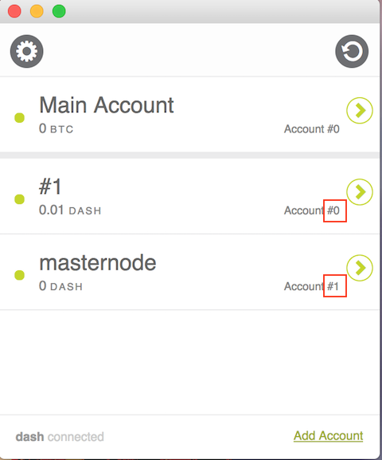
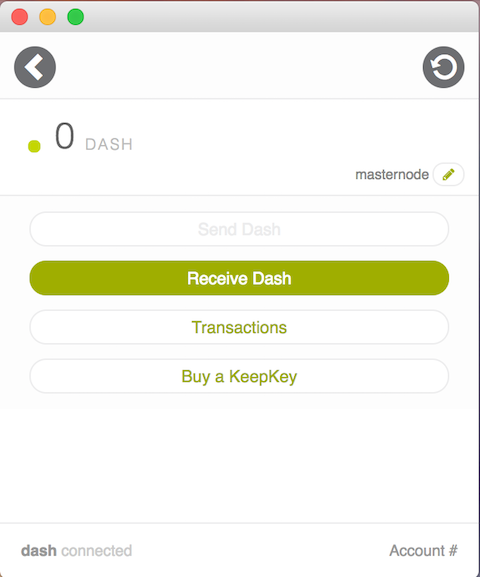
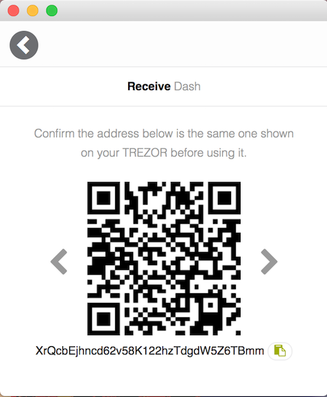

Keepkey
=============================================

- install keepkey rc client

* add account for masternode, this example use Account #1 for masternode
* account_no for config.py is 1

* slect an account for masternode(s), click `receive dash`

* sned 1K fund to shown address

* click right arrow wull show next address

