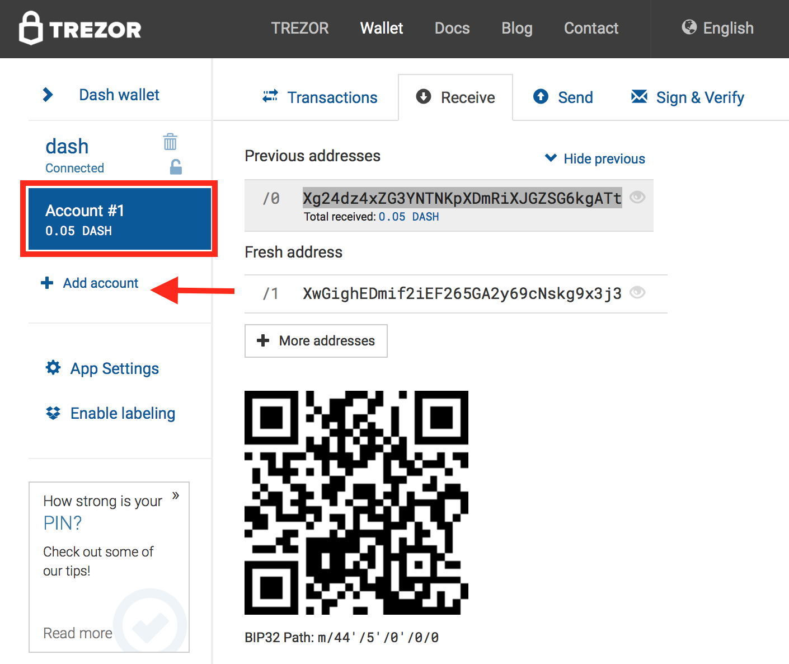
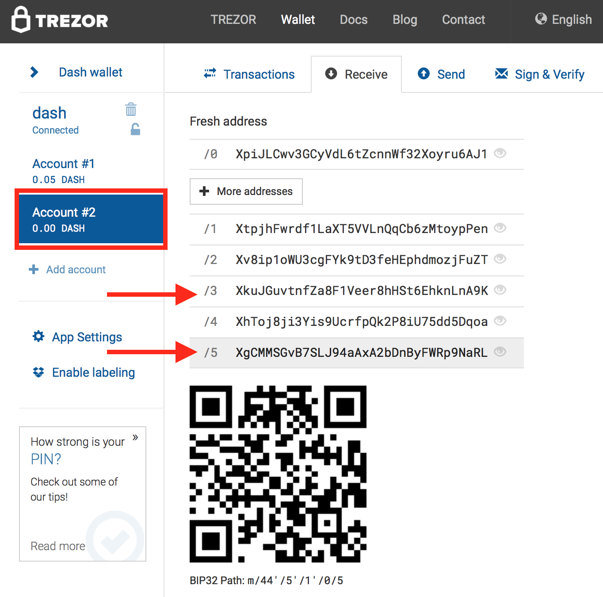
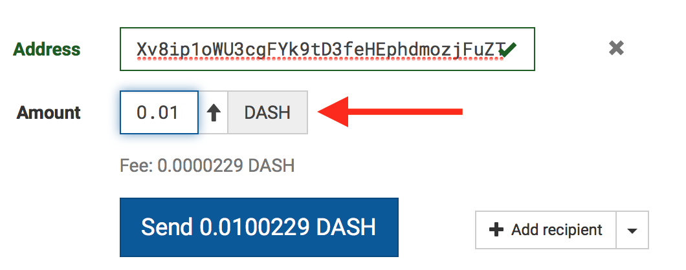
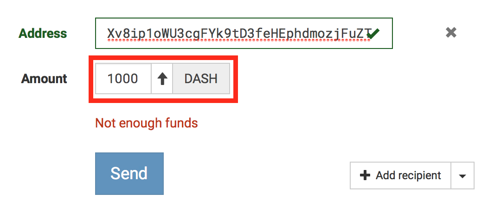
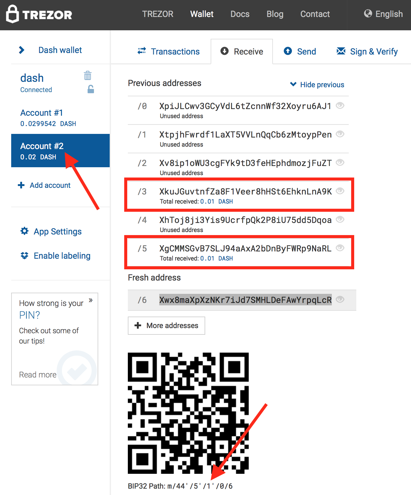

how to use Account #'x' on trezor for masternodes
=============================================

### Q : can I use multiple Account #'x'(multiple bip32 path) with dashmnb ?
    - dashmnb support only single Account #'x'(single bip32 path)
    - can't use mixed account name(Account #1 + Account #2) together
    - can't use mixed(ex: 44'/5'/x'/0/0 + 44'/5'/y'/0/0) path together

### Q : I have mn funds in Account #2, Account #3.
    - run seperate dashmnb for each Account #2, and Account #3 
    - make 2 copy of dashmnb for each Account #'x' like dashmnb2, dashmnb3
    - edit dashlib/config.py and mnconf/masternode.conf of each dashmnb 


### example
- This example uses Account #2 as mn fund(s) account

* press `+ Add account`



* on Receive tab of Account #2, select an address to send 1000 Dash
* each address will have exact 1000 Dash(if you have multiple mns)
* any address can be used, no order
* example select two address


* when sending fund, fee is auto calculated, so Amount should be exact "1000"




* check funds are on right address
* left side Account name(label) has number 2(Account #2), and it's actual BIP32 path has 1' as account number(m/44'/5'/(x)'/0/y : x is 1)
* /5 is last address_index holds fund



```
following 4 questions are keys to make a dashlib/config.py

1) hw wallet type : Trezor or Keepkey
   config name : TYPE_HW_WALLET
   default wallet type is Trezor

2) account number : account #x or bip32 path
   config name : account_no
   check using trezor's web wallet or RC clinet of Keepkey
   if you use 'Account #x' for mn fund(s) on trezor's web wallet(shown in left side) this number is x - 1
   if bip32 path is m/44'/5'/x'/0/y, this number is x

3) an address : will be used to send payouts in hw wallet
   config name : default_receiving_address
   use an address in another account name or an address for daily use
   can leave as blank

4) number of address used in 'Account #x' : last address_index
   config name : max_gab
   this config set max number of address that dashmnb gets from Trezor or Keepkey
   dashmnb uses these addresses to compare collateral address(es) in masternode.conf is correct
   number of masternodes : how many masternodes(1K fund) do you have in hw wallet(if address is sequential)
   number of last address_index that holds fund : /'y' in receive tab
   number of masternodes + 1 or number of last address_index + 1
```   