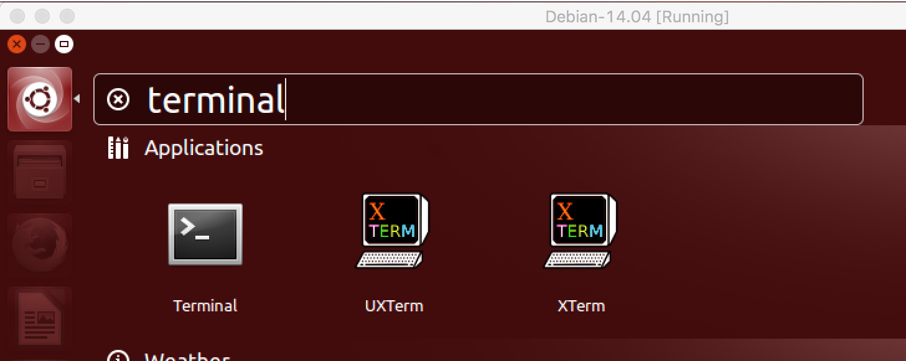
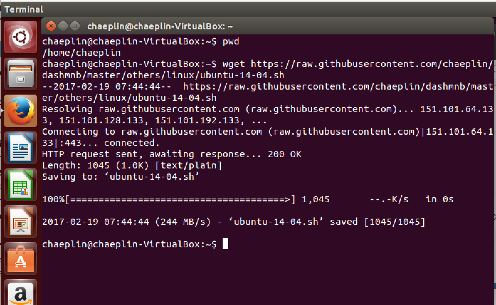
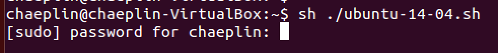
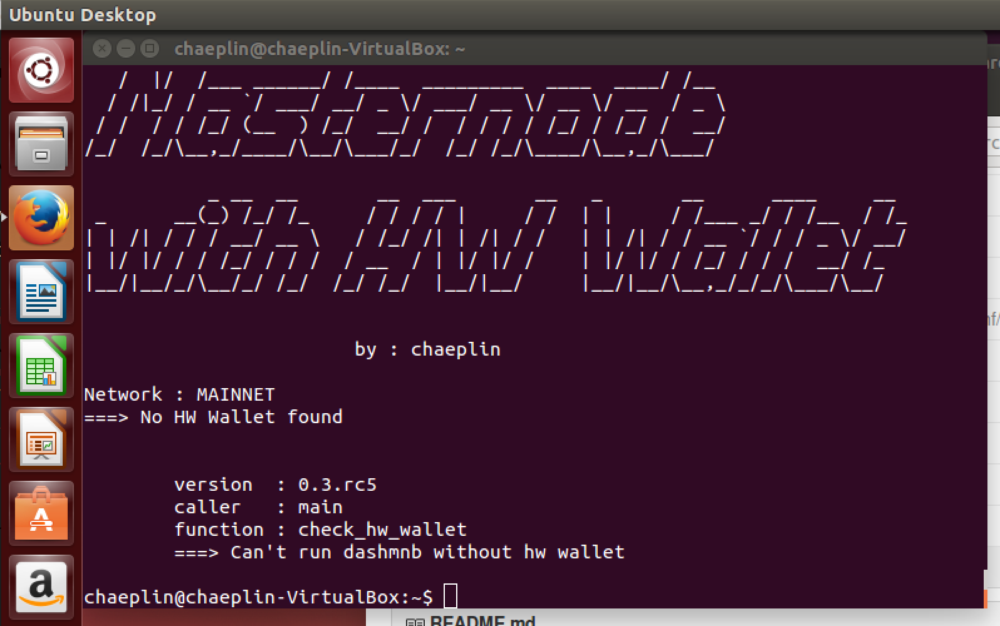
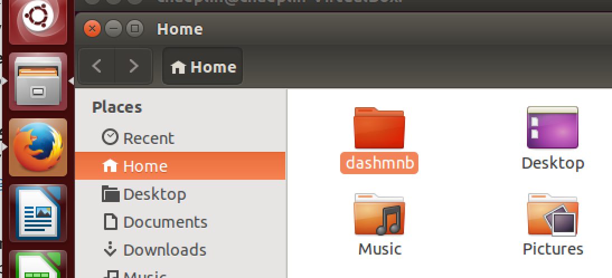
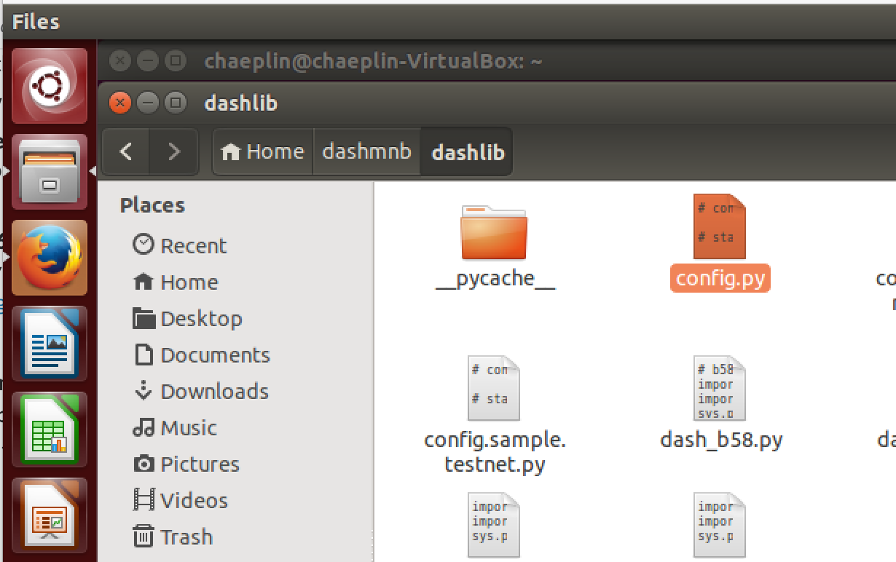
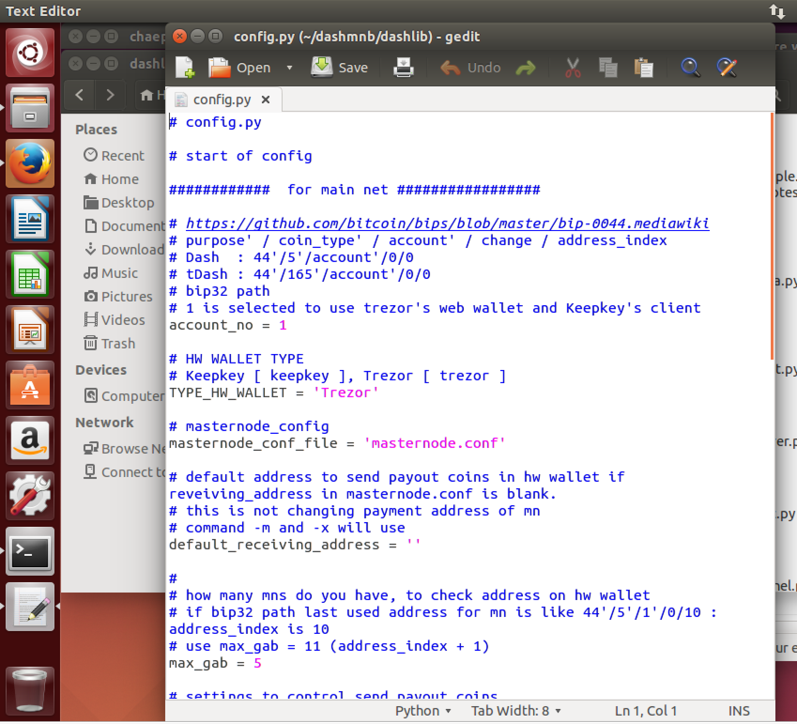
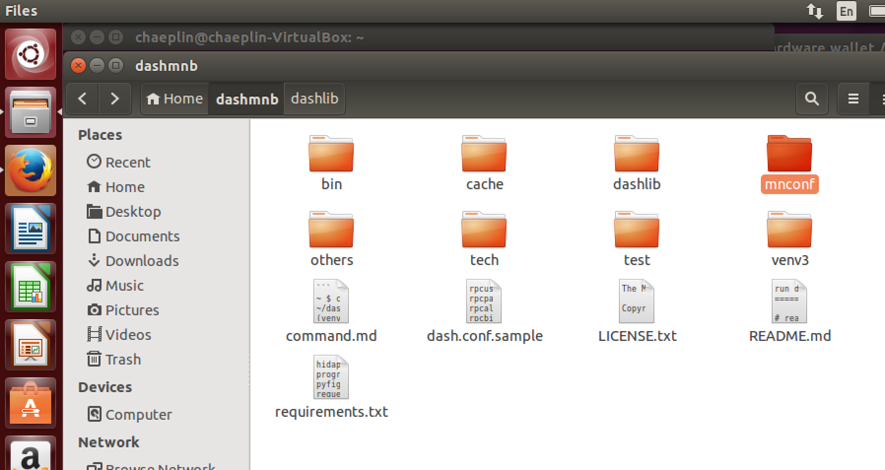
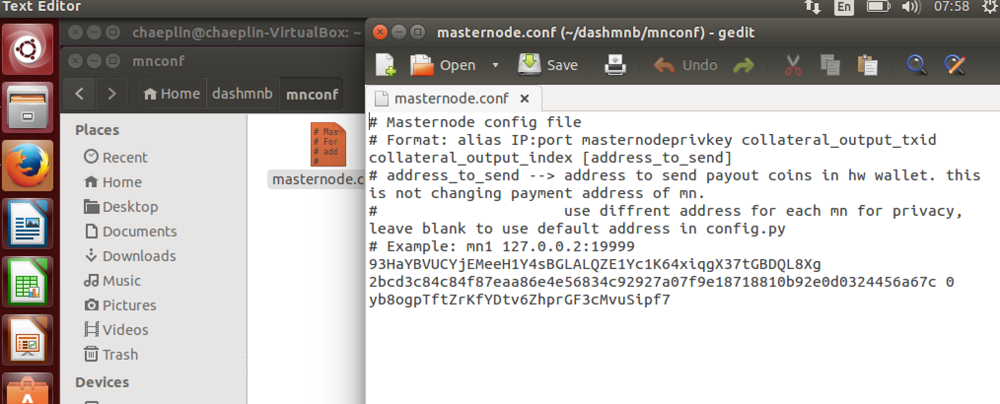

ubuntu-16.04 
=============================================

### 1) open Terminal



### 2) download installation script
```
wget https://raw.githubusercontent.com/chaeplin/dashmnb/master/others/linux/ubuntu-14-04.sh
```


### 3) excute ubuntu-14-04.sh

```
sh ./ubuntu-14-04.sh
```



### 4) when finished following screen will appear




### 5) open folder ~/dashmnb/dashlib and duoble click config.py

gedit will open it

edit following and save it
```
account_no
TYPE_HW_WALLET
masternode_conf_file
default_receiving_address
max_gab
```

https://github.com/chaeplin/dashmnb/tree/master/others/pics/trezor has example






### 6) open folder ~dashmnb/mnconf and rename masternode.conf.sample to masternode.conf

duoble click masternode.conf, gedit will open it

edit redd box and save it






### 7) use following command to start
```
cd ~/dashmnb
. venv3/bin/activate
python bin/dashmnb.py


python bin/dashmnb.py -c


python bin/dashmnb.py -b
```

